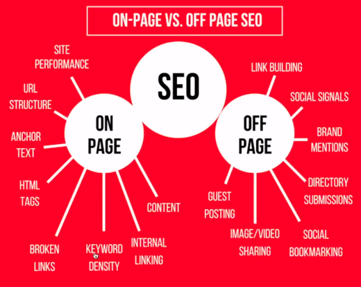

# Navegando pelo SEO

## The Search Engine Optimization

O SEO (Search Engine Optimization) é a otimização para motores de busca. **O SEO é um conjunto de técnicas e práticas que melhoram o posicionamento de um site ou conteúdo na internet. Isso é importante para aumentar o tráfego do seu site, garantindo que as pessoas encontrem as informações relacionadas ao seu negócio. Um site bem posicionado nos resultados de busca é mais visível para os clientes e pode aumentar as vendas.**

> O SEO é essencial para os desenvolvedores, pois mesmo que o site esteja bem construído, se não for encontrado, não adianta.
> É importante estudar profundamente o SEO para obter resultados efetivos.

## Fatores de Otimização

**O SEO é uma ciência complexa, com muitos fatores envolvidos.** Vamos começar pela parte técnica, que está nas mãos dos desenvolvedores. Isso inclui a performance do site, a estrutura da URL, os textos em link e as tags HTML utilizadas. Também é importante definir as palavras-chave relevantes para o site e trabalhar a densidade delas. Além disso, temos os links internos e o conteúdo, que envolve redatores e copywriters. Porém, o SEO também leva em consideração fatores externos, como links externos, compartilhamento em redes sociais e menções de outras marcas. Vamos explorar esses conceitos ao longo da aula.

## Tipos de resultados

Os resultados podem variar dependendo do mecanismo de busca utilizado. **O SERP significa "Search Engine Results Page" (Página de Resultados de Mecanismos de Busca).** Em português, é comumente traduzido como Página de Resultados do Motor de Busca. **SERP é a página que um mecanismo de busca, como o Google, exibe após uma pesquisa feita por um usuário.**

> O entendimento da SERP é crucial para profissionais de SEO (Search Engine Optimization) e marketing digital, pois eles buscam otimizar o conteúdo e as estratégias para melhorar a visibilidade nos resultados de busca e atrair mais tráfego para seus sites.

## Core Web Vitals

**O Core Web Vitals são três métricas que medem a experiência do usuário em sites. O Google criou essas métricas para ajudar até mesmo pessoas sem conhecimento técnico a entender como o desempenho de seus sites está afetando a experiência do usuário.**
As três principais métricas são:

- Largest Contentful Paint (LCP), que mede o tempo de carregamento da página;
- First Input Delay (FID), que mede a interatividade da página;
- Cumulative Layout Shift (CLS), que mede a estabilidade visual da página;
