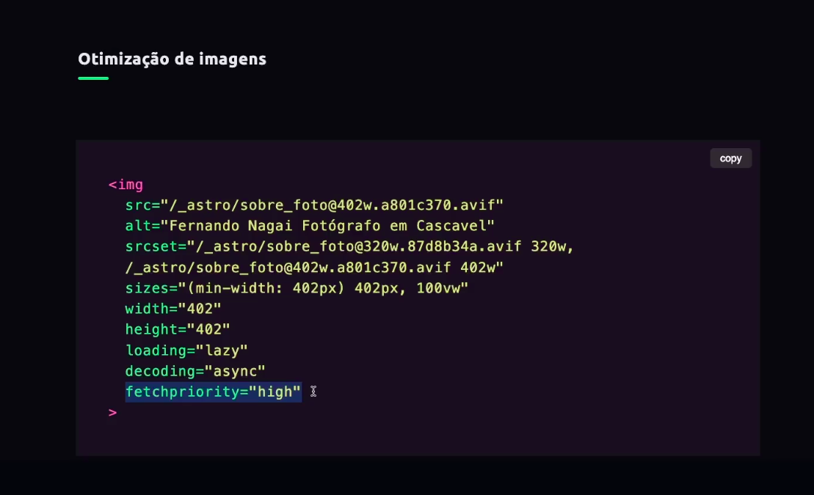

# Otimizacao

## Metatags

**As metatags são tags que ficam dentro do elemento <head> do seu documento HTML e fornecem informações sobre o conteúdo da página.** Algumas das metatags que o Google considera são: a definição do conjunto de caracteres utilizado, a indicação de que o site é responsivo para dispositivos móveis, uma descrição da página, a autoridade do site e a configuração do Safe Search. Vamos explorar mais metatags em aulas futuras.

## Título e descrição

**O Title deve ser único para cada página e definir claramente o objetivo da página.** **Evite repetir títulos em outras páginas do seu site, pois isso diminui a relevância para o SEO.**

**O Description não afeta o ranqueamento nas pesquisas, mas é útil para explicar o conteúdo da página**. Use a ferramenta mangools.com para verificar se o título e a descrição estão adequados. **O Title e o Description são metatags que devem ser colocadas no cabeçalho da página.**

## Google modifica títulos e descrições

**O Google pode alterar títulos que sejam clickbaits, ou seja, títulos que não correspondem ao conteúdo da página. Ele também pode modificar títulos que sejam muito longos ou que contenham apenas palavras-chave**. Além disso, o Google pode alterar as descrições das páginas para melhor atender aos usuários. É importante entender essas modificações e criar títulos coerentes para melhorar o SEO. O Google também pode usar links internos da página para gerar títulos relevantes. Por fim, lembre-se da importância de criar uma Meta Description para ajudar os usuários a entenderem o conteúdo da página.

## Open Graph (og)

**São as meta-tags para as mídias sociais.** Essas tags são importantes para controlar a aparência de um link compartilhado nas redes sociais, como Facebook, LinkedIn e Twitter. **O objetivo é tornar o conteúdo mais atrativo e explicativo, gerando engajamento e mais cliques para a página. Existem várias meta-tags disponíveis, mas as principais são og:title, og:url e og:description.** Além disso, também temos o Twitter Card, que funciona de forma semelhante ao Open Graph. É importante testar as tags usando ferramentas como o Facebook Debugger e o Post Inspector do LinkedIn para garantir que o compartilhamento esteja correto.

## Tags de Texto

**As tags de texto são como a organização de um livro, e é importante estruturá-las corretamente para que o motor de busca entenda o conteúdo da página.** O H1 é o título principal da página e deve ser semelhante ao título do head. Os H2 são subtítulos e podem ter sub-blocos com H3. Os parágrafos são marcados com a tag P e a tag Strong é usada para dar ênfase ao texto. A tag A é usada para criar links internos e externos. **Quanto mais links e menos dependência de estilos, melhor para o SEO.**

## Navegação

**É fundamental que os visitantes consigam se encontrar facilmente e que o robô de busca também entenda a relevância das páginas**. Além disso, uma ótima estratégia para a navegação são os **breadcrumbs**, que ajudam tanto os usuários quanto os motores de busca. Também não se esqueça da importância de uma navegação mobile friendly e de uma página 404 coerente **(que tem um redirecionamento para o usuário voltar e não ficar travado, como última página).**

## Otimização de imagens

**Imagens são pesadas e podem deixar o site lento, então é importante trabalhar com tamanhos adequados e responsivos.** Além disso, é recomendado utilizar formatos mais modernos, como **avif** e **webp**, **que reduzem o tamanho da imagem sem perder qualidade.** **A estratégia de Lazy Loading também é útil, carregando as imagens apenas quando são visíveis na página. Definir largura e altura da imagem ajuda a evitar problemas de layout.** Atributos como **source**, **alt**, **source set**, **sizes**, **loading**, **decoding** e **fetch priorit**y também são importantes para otimizar as imagens. Verifique se há plugins ou ferramentas disponíveis para facilitar esse processo.

> Online existe várias ferramentas para isso.

#### Alguns atributos de Otimização de imagens

## Lazy Load Third Party Content (Conteúdo de Terceiros)

O Lazy Load, é **uma estratégia para carregar e ler conteúdos de terceiros, como embeds do YouTube ou integrações com redes sociais.** A ideia é usar uma **fachada**, **um elemento estático (uma foto por exemplo) que se parece com o conteúdo desejado, mas sem as funcionalidades completas.** Isso adia o carregamento e permite identificar e tratar o tipo de conteúdo. Para identificar, podemos usar o pagespeed.web.dev. Ao aplicar o Lazy Load, podemos melhorar o desempenho do site e a pontuação de performance.

## Mobile Friendly

**O Google dá grande importância ao conteúdo otimizado para dispositivos móveis, através da iniciativa Mobile First Indexing.** **Recomenda-se o uso de estratégias como responsividade e AMP (Accelerated Mobile Pages) para melhorar a experiência do usuário em dispositivos móveis.** É essencial ter uma **meta tag viewport e evitar bloqueios de recursos no robots.txt.** A ferramenta [Lighthouse](https://www.pagespeed.web.dev) pode ser usada para analisar e melhorar a performance do site em dispositivos móveis. Ao implementar essas estratégias, seu site estará mais amigável para dispositivos móveis e será melhor indexado pelo Google.
