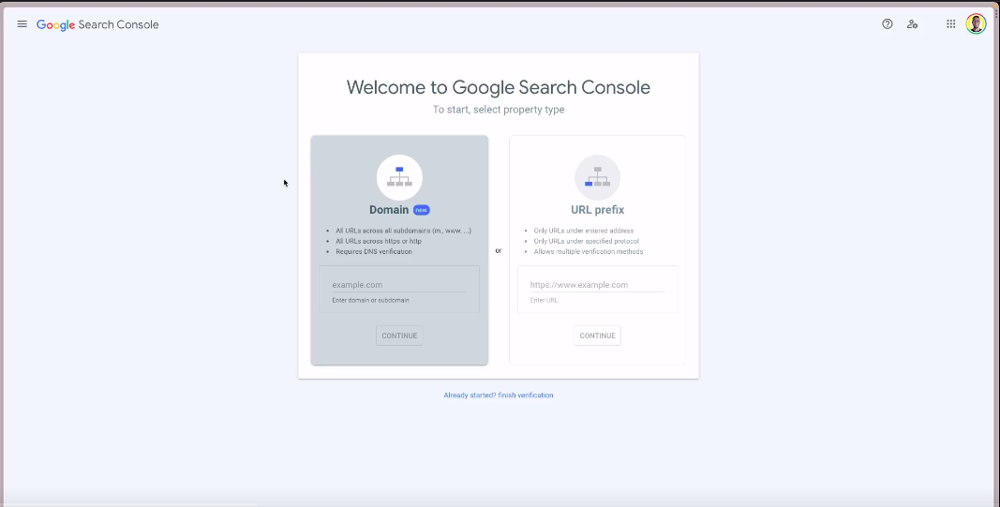
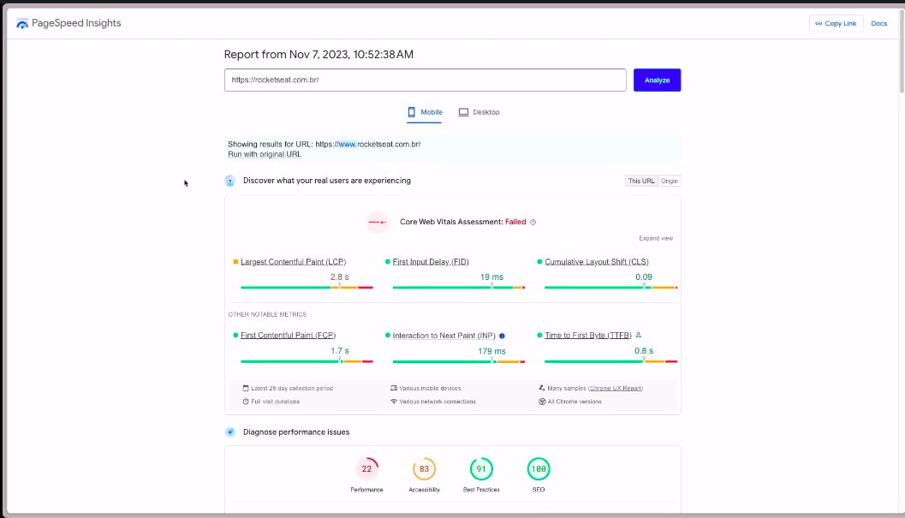
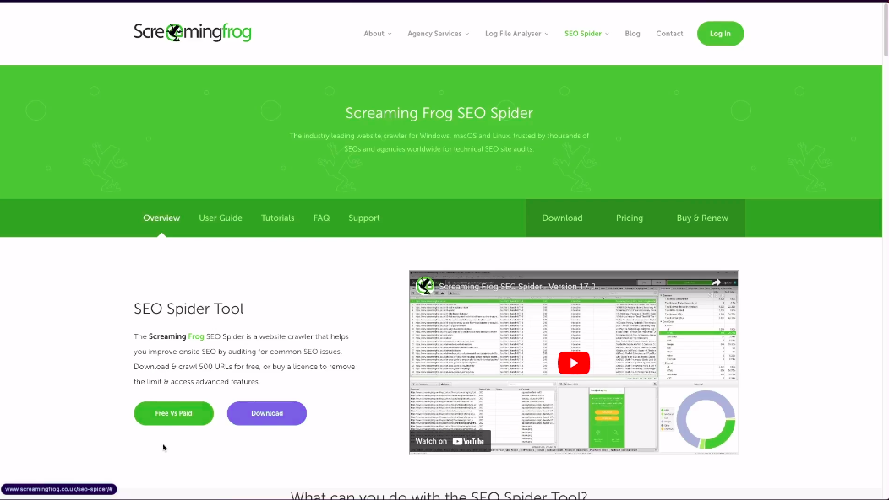

# Ferramentas

## Google Search Console

Através dela, podemos analisar **vários fatores**, como a **indexação de páginas**, **problemas com vídeos**, **criação de sitemaps** e **remoção de URLs indesejadas.**

**Também podemos verificar a experiência do usuário, como os Core Web Vitals e a usabilidade no mobile.** A ferramenta oferece relatórios detalhados e permite que você aprofunde seu conhecimento sobre o desempenho do seu site. Além disso, é possível verificar a propriedade do seu site e explorar as diferentes funcionalidades do Search Console.

## Lighthouse Pagespeed

O **Lighthouse PageSpeed** é uma ferramenta de código aberto desenvolvida pelo Google para avaliar e melhorar o desempenho de páginas da web. Ele analisa várias métricas relacionadas à velocidade, acessibilidade, práticas recomendadas de SEO (Search Engine Optimization) e boas práticas em geral. O Lighthouse fornece uma pontuação geral chamada de "Pontuação PageSpeed" com base nessas análises.

Alguns dos fatores que o **Lighthouse** avalia incluem o **tempo de carregamento da página, o uso eficiente de recursos, a responsividade em diferentes dispositivos, a acessibilidade para usuários com deficiência, entre outros.** A ideia é ajudar os desenvolvedores a identificar áreas de melhoria em seus sites para proporcionar uma melhor experiência ao usuário e otimizar o desempenho na web. O Lighthouse é frequentemente utilizado como uma ferramenta valiosa durante o desenvolvimento e teste de sites para garantir que eles atendam aos padrões de qualidade e eficiência.

## Keyword Planner - Planejamento de conteúdo

O **Keyword Planner, ou Planejador de Palavras-chave**, é uma ferramenta oferecida pelo Google Ads para ajudar na pesquisa e seleção de palavras-chave relevantes para campanhas de publicidade online. Embora inicialmente projetado para auxiliar em campanhas pagas no Google Ads, o Keyword Planner também é frequentemente utilizado por profissionais de marketing de conteúdo para orientar estratégias de SEO (Search Engine Optimization) e planejamento de conteúdo.

## Screaming Frog

A ferramenta **Screaming Frog** é **muito útil para encontrar links quebrados, gerar Sitemap XML e auditar redirecionamentos em nosso site.** A versão gratuita permite até 500 URLs, enquanto a versão paga é ilimitada. A ferramenta oferece uma ampla gama de informações, como links internos e externos, segurança, códigos de resposta, títulos de página, descrições e palavras-chave meta, cabeçalhos, conteúdo, imagens, links canônicos e muito mais. Além disso, ela também identifica problemas, como links faltando títulos de página. O Screaming Frog é uma ferramenta completa e amplamente utilizada por profissionais de SEO.

## Resumindo

Recomendamos que você guarde o link developers.google.com.br, pois é lá que você encontrará as atualizações mais recentes. O SEO do Google e de outras plataformas está sempre mudando, então é importante se atualizar. No site, você encontrará documentação e informações mais específicas para aprofundar seu conhecimento.
