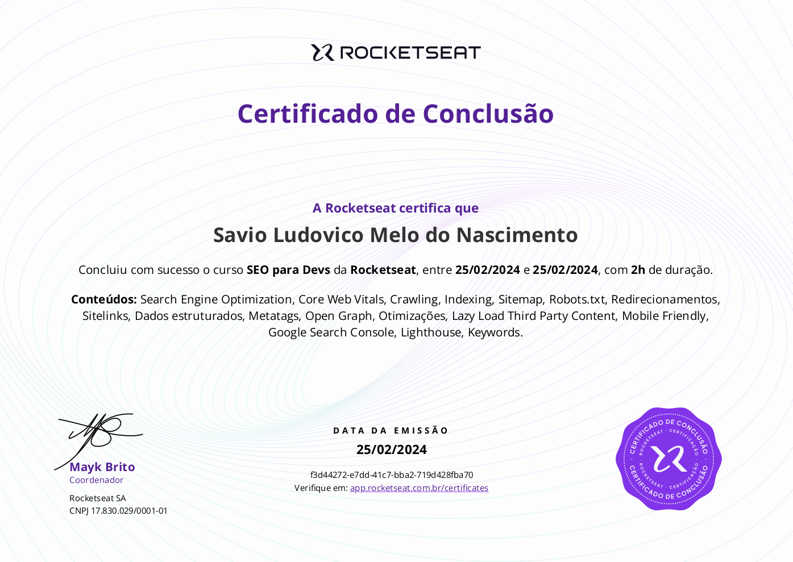

# Seo para Devs

**Neste curso de SEO para Devs, será ensinado como otimizar seu site para que ele seja encontrado pelos usuários.**

#### Vamos explorar o que é SEO:

- Seus pilares e fatores de otimização.
- Também abordaremos os tipos de resultados de busca e o **Core Web Vitals**:
  - Que são regras do Google para melhorar a experiência do usuário.
- Você aprenderá sobre Crawling e Indexing;
- Como o robô do Google funciona;
- O processo de Rendering.
- Discutiremos boas práticas de URLs, criação de links e a importância do Sitemap.xml e do Robots.txt;
- Abordaremos a Canonicalização, a importância dos Redirects e como estruturar dados para resultados diferentes no Google;

> **Na parte de otimização, falaremos sobre MetaTags, títulos, descrições, Open Graph, tags de texto, navegação, otimização de imagens, carregamento de conteúdos de terceiros e a importância da compatibilidade com dispositivos móveis.**
> Por fim, será apresentado algumas ferramentas como o Google Search Console, Lighthouse, Screaming Frog e Keyword Planners.

#### Concluído

